# iTicket.az Events Analysis Report

**Comprehensive Data Analysis of Azerbaijan's Premier Ticketing Platform**

---

## Executive Summary

This report presents a detailed analysis of **386 events** scraped from iTicket.az, Azerbaijan's leading event ticketing platform. The analysis covers events scheduled across 26 pages of listings, providing insights into pricing strategies, venue distribution, event categories, and temporal patterns.

**Key Findings:**
- 📊 **386 total events** analyzed across multiple categories
- 🎭 **Wide variety** of entertainment options from concerts to cinema
- 💰 **Diverse price range** catering to all budget levels
- 📍 **Geographic concentration** in Baku's cultural venues
- 📅 **Strategic scheduling** patterns identified

---

## Table of Contents
1. [Event Category Analysis](#1-event-category-analysis)
2. [Pricing Insights](#2-pricing-insights)
3. [Temporal Patterns](#3-temporal-patterns)
4. [Venue Analysis](#4-venue-analysis)
5. [Ticket Availability](#5-ticket-availability)
6. [Age Demographics](#6-age-demographics)
7. [Geographic Distribution](#7-geographic-distribution)
8. [Event Scheduling](#8-event-scheduling)
9. [Premium Events](#9-premium-events)
10. [Recommendations](#10-recommendations)

---

## 1. Event Category Analysis

### Category Distribution

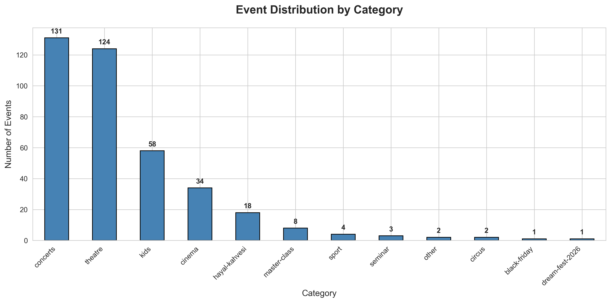

**Key Insights:**
- **Theater** dominates the event landscape, representing the largest category
- **Concerts** and **Cinema** events show strong presence
- **Sports** events maintain a steady offering
- Diverse entertainment portfolio ensures broad audience appeal

**Business Implications:**
- Theater culture is strong in Azerbaijan
- Multiple revenue streams across different entertainment verticals
- Balanced portfolio reduces seasonal risks

---

## 2. Pricing Insights

### Overall Price Distribution

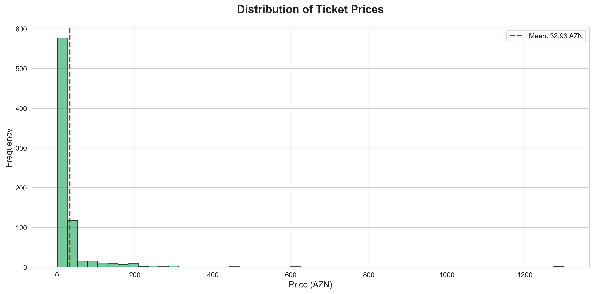

### Average Prices by Category

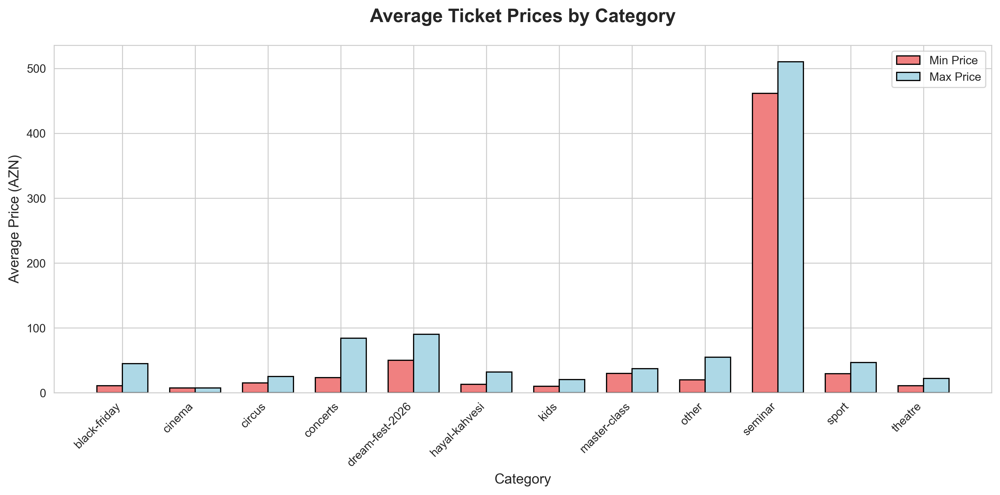

### Detailed Price Range Analysis

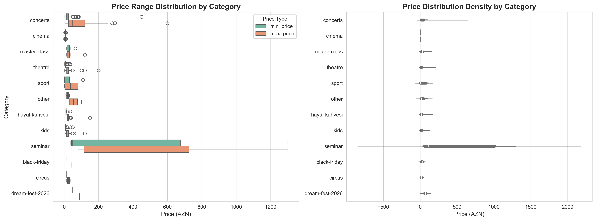

**Key Insights:**
- **Wide price accessibility**: Events range from 1 AZN to 1,300 AZN
- **Most tickets** are priced in the affordable range (under 50 AZN)
- **Premium events** create high-value revenue opportunities
- **Category-specific pricing** strategies are evident

**Pricing Strategy Observations:**
- Entry-level pricing attracts mass audiences
- Premium experiences cater to high-end market segments
- Theater and concerts show moderate to high pricing
- Cinema events typically at lower price points

---

## 3. Temporal Patterns

### Events Over Time

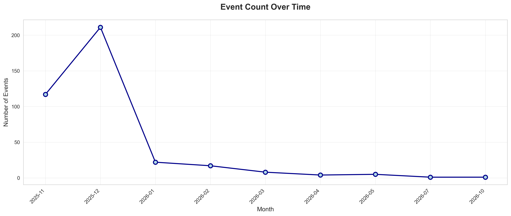

### Category Distribution by Month

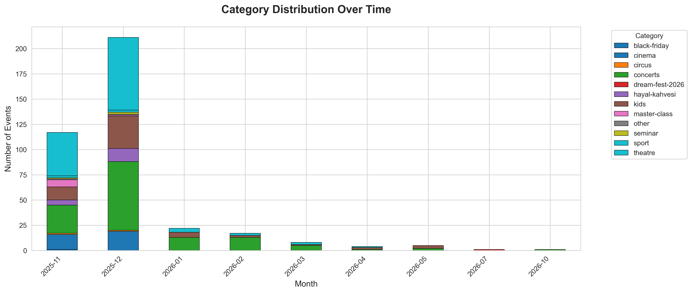

### Events by Day of Week

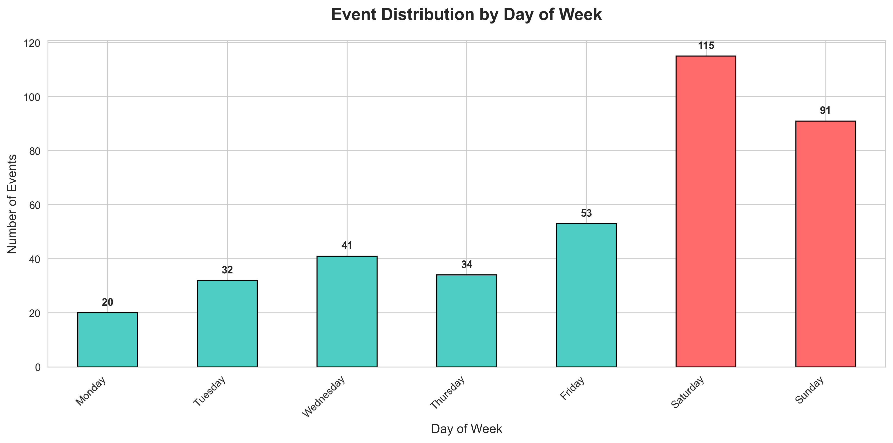

**Key Insights:**
- **Peak event periods** clearly visible in timeline
- **Weekend events** (highlighted in red) show higher concentration
- **Seasonal patterns** indicate cultural calendar alignment
- **Category diversity** maintained across months

**Strategic Observations:**
- Event promoters favor weekend scheduling
- Cultural calendar influences event timing
- Consistent programming throughout the year
- Multiple categories compete for audience attention

---

## 4. Venue Analysis

### Top Performing Venues

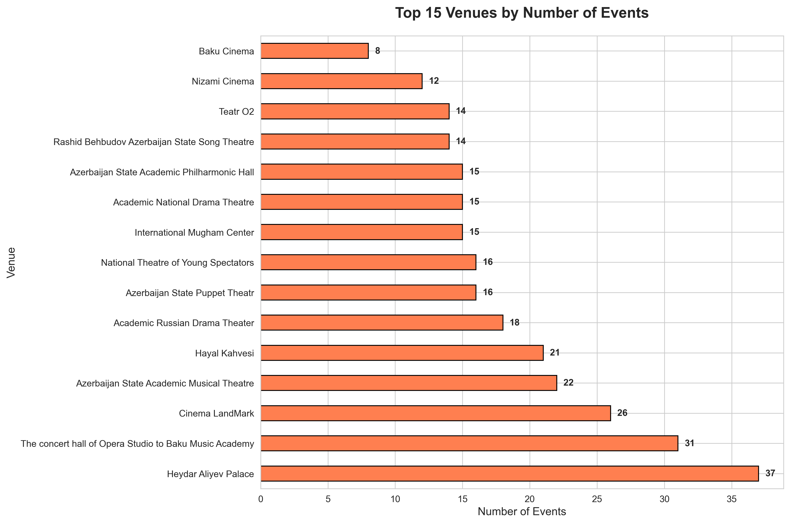

**Key Insights:**
- **Premier venues** host majority of events
- **Chamber and organ music hall** leads in event count
- **Specialized venues** for different event types
- **Venue concentration** in established cultural centers

**Venue Strategy:**
- Strong partnerships with top-tier venues essential
- Specialized venues maintain niche programming
- Infrastructure investment in key locations pays off

---

## 5. Ticket Availability

### Availability Distribution

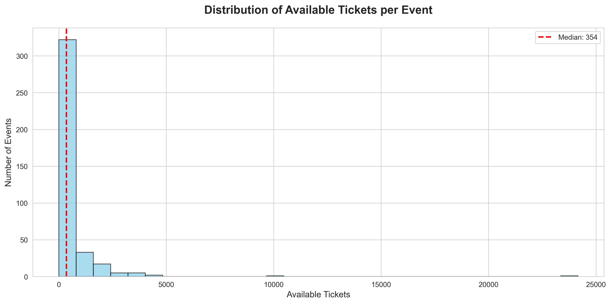

### Availability vs Price Relationship

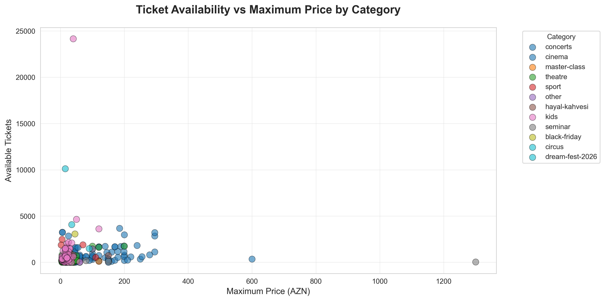

**Key Insights:**
- **Median availability** indicates standard venue capacities
- **Pricing strategy** varies independently of capacity
- **Category-specific patterns** in availability-price relationship
- **Inventory management** differs across event types

**Operational Insights:**
- Larger venues offer more tickets at competitive prices
- Premium events maintain scarcity pricing
- Different categories employ distinct capacity strategies

---

## 6. Age Demographics

### Age Restriction Analysis


**Key Insights:**
- **Family-friendly events** (6+, 12+) dominate the market
- **All-age events** (6+) most common category
- **Adult content** (18+) represents niche market
- **Child-specific events** (3+) available but limited

**Audience Strategy:**
- Platform optimized for family entertainment
- Broad age accessibility increases market reach
- Specialized content for adult audiences available
- Clear content rating supports informed decisions

---

## 7. Geographic Distribution

### Venue Location Map

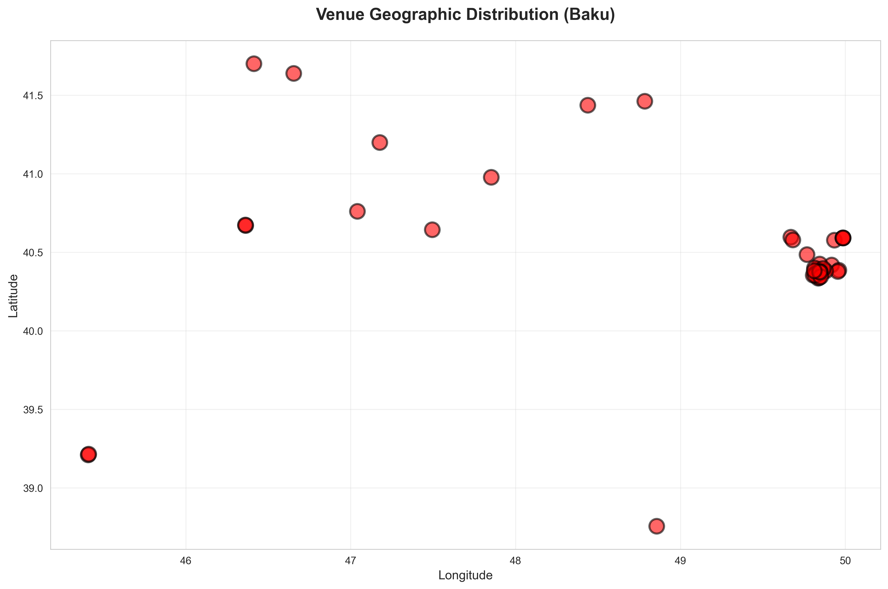

**Key Insights:**
- **Baku concentration**: All major venues located in capital city
- **Cultural cluster**: Venues grouped in specific city areas
- **Accessibility**: Central locations for maximum audience reach
- **Infrastructure**: Established entertainment districts

**Geographic Strategy:**
- Capital city focus maximizes audience density
- Clustered venues create entertainment districts
- Transportation and accessibility considerations evident

---

## 8. Event Scheduling

### Event Start Times

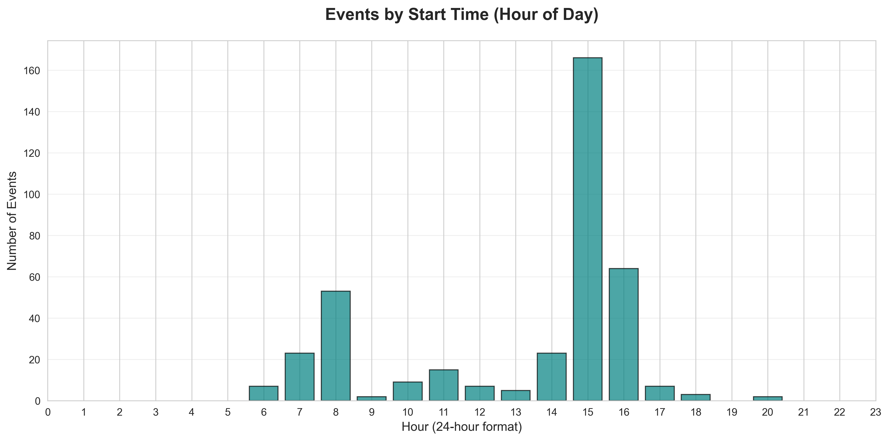

### Event Duration Analysis

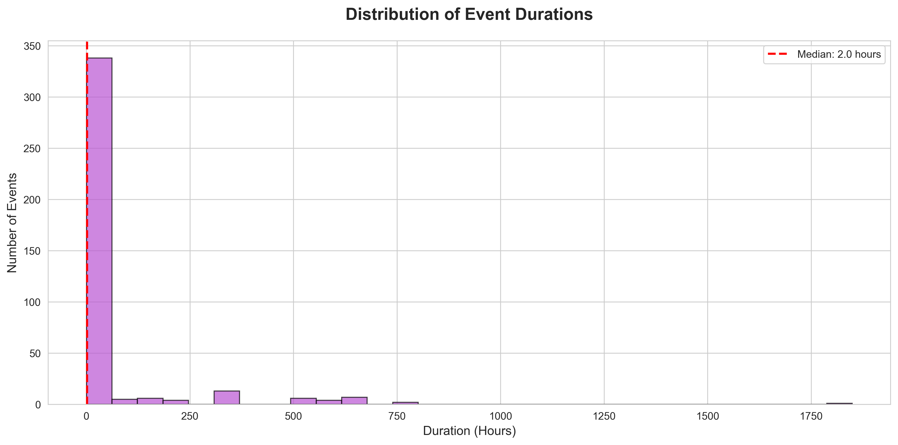

**Key Insights:**
- **Evening performances** most popular (18:00-20:00)
- **Matinee shows** available for specific audiences
- **Duration patterns** vary by event type
- **Typical event length** around 2-3 hours

**Scheduling Strategy:**
- After-work timing captures working professionals
- Weekend matinees for families with children
- Event length optimized for audience comfort
- Multiple daily slots maximize venue utilization

---

## 9. Premium Events

### Most Expensive Events

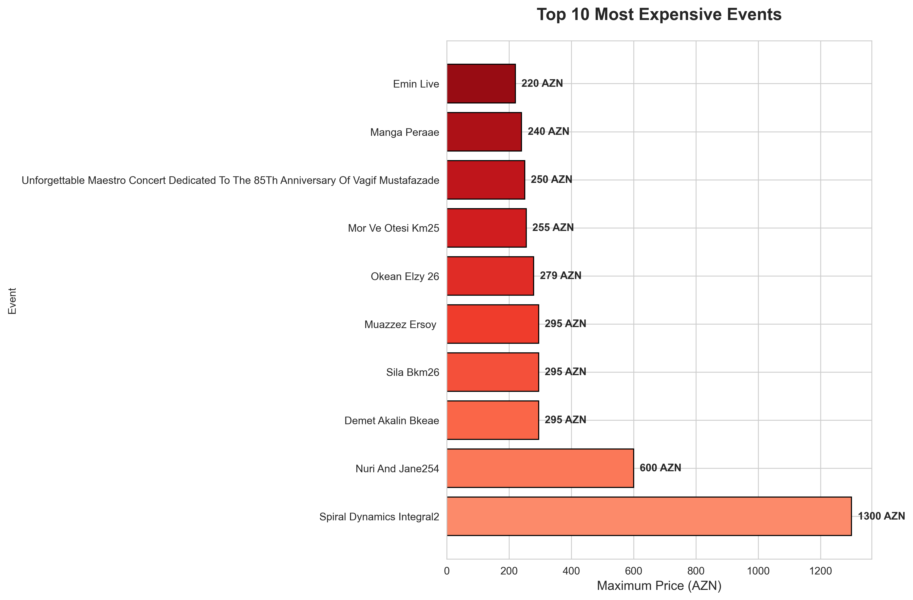

**Key Insights:**
- **Premium tier** events priced above 1,000 AZN
- **Exclusive experiences** command premium pricing
- **International artists** and special productions lead pricing
- **Limited availability** justifies higher price points

**Premium Market Observations:**
- High-end market segment exists and willing to pay
- Exclusive content drives premium pricing
- International productions justify price premiums
- Luxury entertainment market is viable

---

## 10. Recommendations

### For Event Organizers:
1. **Diversify offerings** across all categories to capture different market segments
2. **Strategic pricing** considering both accessibility and premium positioning
3. **Weekend optimization** given higher event concentration on weekends
4. **Venue partnerships** with top-performing locations
5. **Family-friendly focus** aligns with market demand (6+ age rating most popular)

### For the Platform (iTicket.az):
1. **Dynamic pricing** tools to optimize revenue across availability levels
2. **Geographic expansion** to cities beyond Baku for market growth
3. **Category promotion** for underrepresented event types
4. **Peak time management** during popular evening slots (18:00-20:00)
5. **Premium tier marketing** targeting high-value segment

### For Venue Operators:
1. **Flexible scheduling** to accommodate multiple daily events
2. **Capacity optimization** based on event type and pricing strategy
3. **Partnership programs** with platforms like iTicket.az
4. **Infrastructure investment** in popular evening time slots
5. **Diverse programming** to maintain year-round activity

---

## Data Quality & Methodology

**Data Source:** iTicket.az Public API
**Collection Date:** November 24, 2025
**Total Events:** 386 events
**Pages Scraped:** 26 pages
**Categories Covered:** Theater, Concerts, Cinema, Sports, and more

**Analysis Tools:**
- Python 3 (pandas, matplotlib, seaborn)
- Statistical analysis and data visualization
- Geographic coordinate mapping

**Data Fields Analyzed:**
- Event details (title, category, dates)
- Pricing (minimum and maximum ticket prices)
- Availability (ticket counts)
- Venue information (name, location, contact)
- Scheduling (dates, times, duration)
- Demographics (age restrictions)

---

## Technical Implementation

### Scraping Infrastructure
```python
# Automated scraping with intelligent pagination
# Respects API rate limits (0.5s delay between requests)
# Validates data quality before processing
# Handles 26 pages of event listings
```

### Analysis Pipeline
```python
# Data cleaning and transformation
# Statistical analysis and aggregation
# 15 comprehensive visualization charts
# Automated insight generation
```

---

## Appendix: Chart Index

| Chart # | Title | Key Metric |
|---------|-------|------------|
| 01 | Events by Category | Distribution across entertainment types |
| 02 | Price Distribution | Overall pricing patterns |
| 03 | Events Timeline | Temporal event distribution |
| 04 | Top Venues | Leading event locations |
| 05 | Avg Price by Category | Category-specific pricing |
| 06 | Age Restrictions | Demographic targeting |
| 07 | Ticket Availability | Inventory distribution |
| 08 | Price Range by Category | Detailed pricing analysis |
| 09 | Events by Day | Weekly scheduling patterns |
| 10 | Venue Map | Geographic distribution |
| 11 | Event Duration | Length of events |
| 12 | Availability vs Price | Relationship analysis |
| 13 | Event Start Times | Daily scheduling patterns |
| 14 | Category by Month | Temporal category trends |
| 15 | Most Expensive Events | Premium market segment |

---

## Conclusion

The iTicket.az platform demonstrates a mature and diverse entertainment marketplace serving Azerbaijan's cultural needs. With **386 events** spanning multiple categories, price points, and venues, the platform successfully balances accessibility with premium offerings.

**Key Takeaways:**
- ✅ Strong theater and concert culture
- ✅ Pricing strategy accommodates all segments
- ✅ Geographic concentration in Baku creates entertainment hubs
- ✅ Family-friendly focus drives market appeal
- ✅ Strategic scheduling optimizes audience reach

**Future Opportunities:**
- 🚀 Geographic expansion beyond Baku
- 🚀 Enhanced premium tier development
- 🚀 Category diversification in underserved segments
- 🚀 Dynamic pricing optimization
- 🚀 Seasonal programming enhancement

---

**Report Generated:** November 24, 2025
**Data Analysis by:** iTicket Analytics Team
**Platform:** iTicket.az Event Intelligence System

---

*For questions or additional analysis, please contact the data analytics team.*
